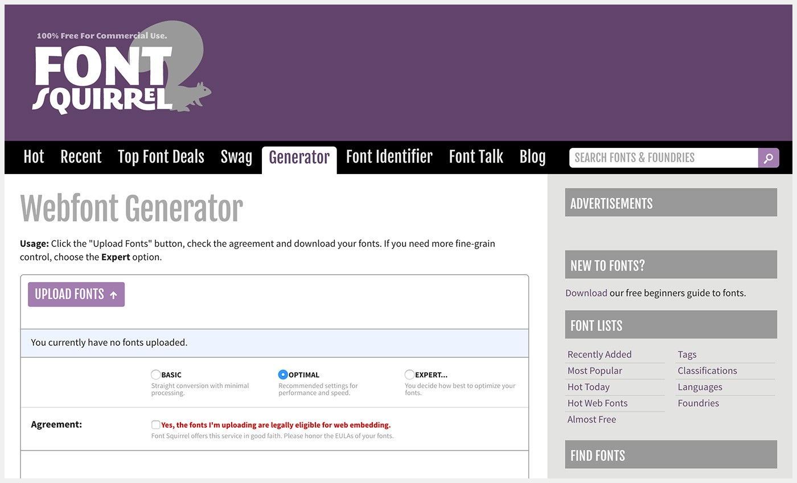
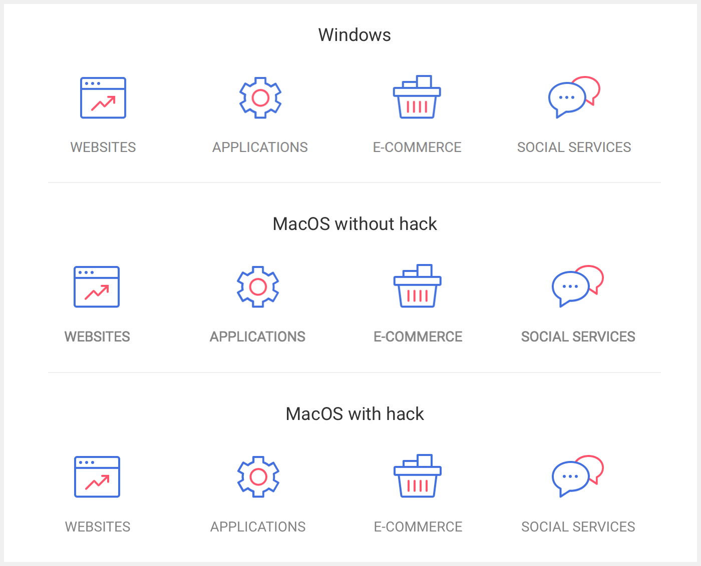

## Introduction

We often use Google Fonts during our design and development process. It’s the simplest way to add fonts to a website, and Google’s selection is excellent in terms of both quality and compatibility. When we need to use custom fonts, our choice is Font Squirrel.

Here, we’ve compiled a short guide to get you started with these tools.

## Content

- How to add one or few fonts with Google Fonts?
- How to use Google Fonts locally?
- How to use custom fonts?
- How to keep web fonts consistent across all platforms?

## How to add one or few fonts with Google Fonts

Go to [Google Fonts](https://fonts.google.com/).


1. Find and add fonts.
2. Select only the styles and settings that are absolutely necessary (Light, Regular, Bold). Don’t use Cyrillic extended; in most cases, simple Cyrillic will suffice. Extended versions use symbols from rare alphabets that contain out-of-date and church letters. (Some of them are still being used by settlements in Siberia.)
3. Copy and paste a link to the fonts you’re using in your project.

```html
<link
  href="https://fonts.googleapis.com/css?family=Open+Sans:400,700|Roboto:400,700"
  rel="stylesheet"
/>
```

Double check with your designer if you find more than two custom fonts with more than three different styles. This will adversely affect page load speed.

## How to use Google Fonts locally

We use [google-webfonts-helper](https://google-webfonts-helper.herokuapp.com) for downloading prepared fonts from the Google Fonts database.


1. Find font.
2. Choose styles.
3. Copy CSS.
4. Download kit.

To use fonts on the Ruby on Rails application, copy these files from the archive to the assets/fonts directory. Create an additional file, fonts.css.scss, in assets/stylesheets/application. Then, paste the CSS from the third step here. The last thing to do is replace the path to the fonts to work with asset helper.

```css
@font-face {
  font-family: 'Poiret One';
  font-style: normal;
  font-weight: 400;
  src: url(font_path('poiret-one-v4-cyrillic_latin-regular.eot')); /* IE9 Compat Modes */
  src: local('Poiret One'), local('PoiretOne-Regular'),
    url(font_path('poiret-one-v4-cyrillic_latin-regular.eot?#iefix')) format('embedded-opentype'), /* IE6-IE8 */
      url(font_path('poiret-one-v4-cyrillic_latin-regular.woff2')) format('woff2'),
    /* Super Modern Browsers */ url(font_path('poiret-one-v4-cyrillic_latin-regular.woff')) format('woff'),
    /* Modern Browsers */ url(font_path('poiret-one-v4-cyrillic_latin-regular.ttf')) format('truetype'),
    /* Safari, Android, iOS */ url(font_path('poiret-one-v4-cyrillic_latin-regular.svg#PoiretOne'))
      format('svg'); /* Legacy iOS */
}
```

## How to use custom fonts

Sometimes, you’ll need to use custom fonts that are not available from Google Fonts. For this, we like to use Font Squirrel. It’s a very user-friendly service for converting fonts for web usage, and you’ll find a lot of conversion settings in expert mode. Keep in mind, however, that you will not get exactly the same quality as you would with an original web font.



## How to keep web fonts consistent across all platforms

Some of you will have already noticed that fonts rendered on macOS, Linux, and Windows all look slightly different. On macOS and Linux, fonts look bolder.



To prevent this problem and make fonts consistent on all platforms, I suggest that you use font-smoothing: antialiased. The font-smooth CSS property controls the application of anti-aliasing when fonts are rendered. Antialiasing smooths fonts at the pixel level, as opposed to on the subpixel. Switching from subpixel rendering to antialiasing for light text on dark backgrounds makes fonts look lighter.

```css
body {
  -webkit-font-smoothing: antialiased;
  -moz-osx-font-smoothing: grayscale;
}
```
