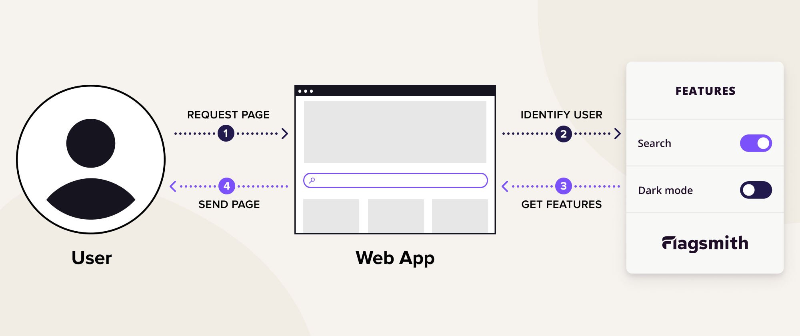
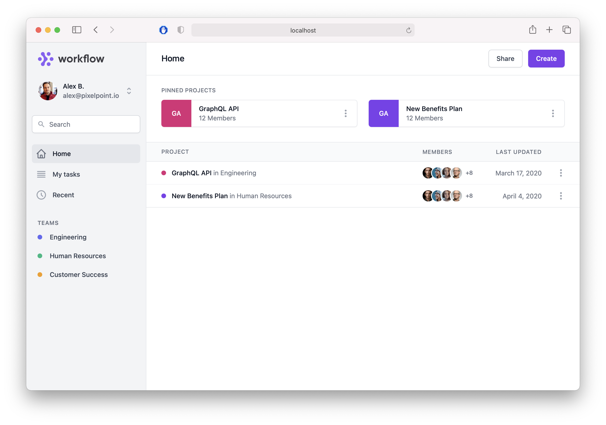
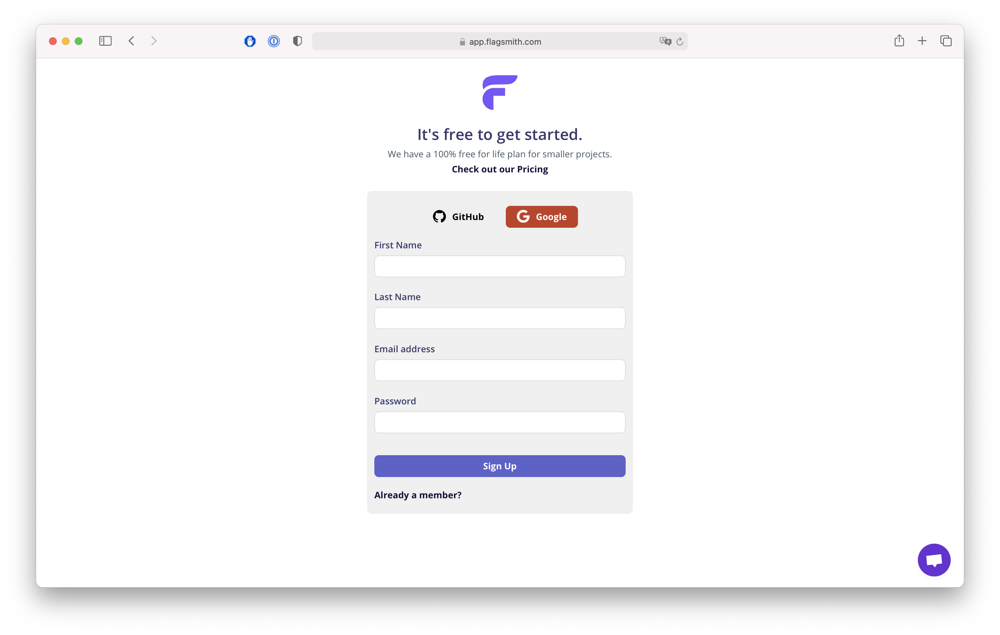
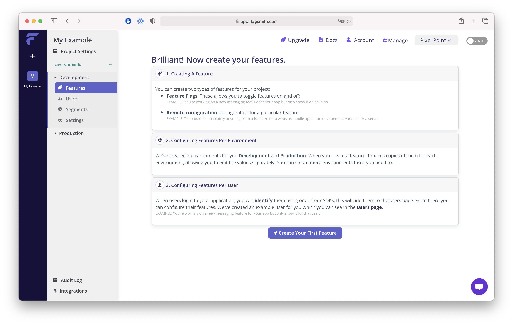
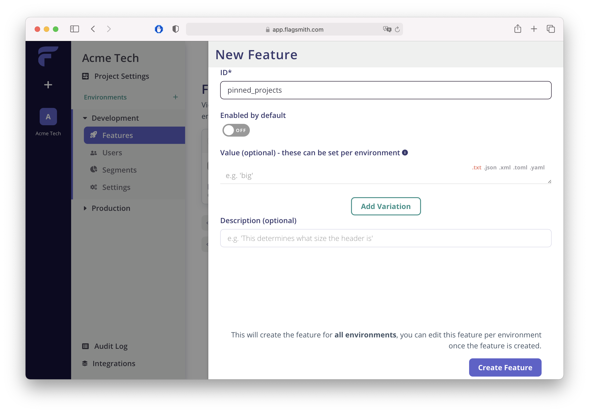
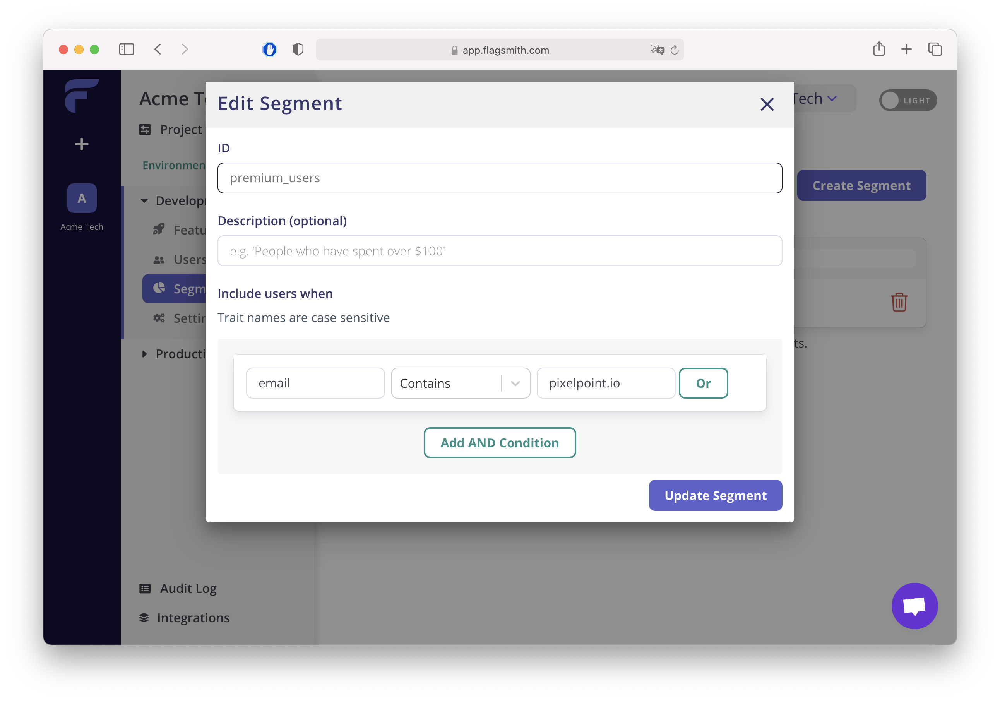

## Overview

Have you ever wondered how do companies like Slack, Netlify, Zoom, Facebook (and rest of FAANG for sure) gradually roll out new features just for some users? 🤔

Wonder no more! It is done via Feature Flags (or FF for short) and we're just about to dive into this concept.

Feature Flags services work the following way. You define a list of features(eg. dark mode, horizontal login layout, design 2.0) and assign it to a group of users specifying conditions whether it should be enabled or disabled.

Chances are that you've already used FF in your projects but wasn't aware of this. Did you store in a database some booleans that indicate whether particular user should have an access to a certain feature? If yes, then congratulations - you indeed have experience working with feature flags.

Booleans in DB were good up to a certain point, but progress never stops and now we have much more flexible and dev friendly way to control feature presence. Let's take a look at feature flags services. FF services have the following bonuses:

- UI where you can define and manage features
- Users segmentation
- A/B testing
- Flags analytics
- Staged feature rollouts
- SDKs for different languages/frameworks

In this article, we are going to use [Flagsmith](https://github.com/Flagsmith/flagsmith) - open source feature flag and remote config service, but you can check commercial alternatives such as [LaunchDarkly](https://launchdarkly.com/). Our goal is to learn how to start using feature flags in React and make the process of launching new functionality for users smoother.

FF manipulation with Flagsmith can be done pretty much anywhere (frontend/backend/mobile platform). Let's take a look at the following schema:



Let's break down what is happening here.

1. User requests the page
2. A certain side of your app (FE/BE) makes a call to Flagsmith service with user uuid
3. Flagsmith matches received uuid with the configuration of available features for this particular user and returns the info on that
4. App generates a page based on received feature info

Definitely not a rocket science. Now to practice!
GitHub logo Flagsmith / flagsmith
Open Source Feature Flagging and Remote Config Service. Host on-prem or use our hosted version at [https://flagsmith.com/](https://flagsmith.com/)

## Our goal

We want to build pretty much standard dashboard app (sorry, no todos today) with authorization set up. We want to show certain feature components only to those users who opted-in for beta.

React, Next.js, Next-Auth and beautiful dashboard components from Tailwind UI are going to help us building it.



## Pre-requirements

Create a new app with Next.js, React and Next-Auth or clone this [sample repository](https://github.com/Flagsmith/flagsmith-js-client/tree/main/examples/nextjs-auth)

Additional links

[Getting started with Next.js](https://nextjs.org/docs/getting-started)

[Getting started with nextauth](https://next-auth.js.org/getting-started/introduction)

[Then create an account](https://flagsmith.com/) in the cloud version of Flagsmith.



## Configure Flagsmith environment

The configuration process is simple. Once you've signed up, create a new project. In Flagsmith you can define multiple environments per project, each environment keeps its own features/users/segments and API key.



Let's create our first feature, we will name it - "pinned_projects". Beta users will be able to pin projects and see them.



Next step we need to install `flagsmith-react` package

```bash
npm i flagsmith-react
```

As an initial step, we will wrap our \_app.js with FlagsmithProvider and pass Flagsmith API key, which we can get from the Settings page in Flagsmith UI. FlagsmithProvider will allow to use useFlagsmith hook and pass the state to underlying components.

```jsx
import Auth from 'components/auth';
import { Provider as SessionProvider } from 'next-auth/client';
import { FlagsmithProvider } from 'flagsmith-react';

import '../styles/globals.css';

export default function MyApp({ Component, pageProps }) {
  return (
    <FlagsmithProvider environmentId={process.env.NEXT_PUBLIC_FLAGSMITH_API_KEY}>
      <SessionProvider session={pageProps.session}>
        {Component.auth ? (
          <Auth>
            <Component {...pageProps} />
          </Auth>
        ) : (
          <Component {...pageProps} />
        )}
      </SessionProvider>
    </FlagsmithProvider>
  );
}
```

`FlagsmithProvider` will initialise Flagsmith javascript client under the hood and you will be able to start getting flags declared in the UI. But it does not make too much sense unless we get user-specific flags. To let Flagsmith know which user requests flags, we need to identify him. The perfect place for this Auth component, that responsible for checking user session and redirecting users to the sign-in page in case it's expired.

```jsx
import { useSession, signIn } from 'next-auth/client';
import { useEffect } from 'react';
import { useFlagsmith } from 'flagsmith-react';

export default function Auth({ children }) {
  const { identify, isIdentified, getTrait, setTrait } = useFlagsmith();
  const [session, loading] = useSession();
  const isUser = !!session?.user;

  // Identify user and set email trait if does not exist
  const identifyUser = async (id, email) => {
    await identify(id);
    const hasEmail = !!getTrait('email');
    if (!hasEmail) {
      setTrait('email', email);
    }
  };

  useEffect(() => {
    if (loading) return; // Do nothing while loading
    if (!isUser) signIn(); // If not authenticated, force log in
  }, [isUser, loading]);

  useEffect(() => {
    if (isUser && !isIdentified) {
      // In the example we don't save users in the database so we don't have id that should be used for identification
      // Instead we're going to use email as a trait and id
      identifyUser(session.user.email, session.user.email);
    }
  }, [isIdentified, identify, session, isUser]);

  if (isUser) {
    return children;
  }

  // Session is being fetched, or no user.
  // If no user, useEffect() will redirect.
  return <div />;
}
```

Here you can see that we use `getTrait` and `setTrait`. Traits are simply key/value pairs that are associated with individual Identities. You can pass any additional information to the user, that later could be used for segmentation eg. current plan, opt-in for beta features or newsletters, etc.

Let's create first segment and call it `beta_opt_in` . Go to Segments → Create Segment. Here you also could define an expression based on the trait which will add users that match that condition to the segment. We can start from a simple one, such as if email has `[maxelpoint.io](http://maxel-point-website.vercel.app/)` consider them as opted-in for beta features.



The final step is to add a check to our React component using `hasFeature("pinned_projects")`.

```jsx
const Home = () => {
  const { hasFeature } = useFlagsmith();

  return (
    <>
      <main className="relative z-0 flex-1 overflow-y-auto focus:outline-none">
        <div className="border-gray-200 border-b px-4 py-4 lg:px-8 sm:flex sm:items-center sm:justify-between sm:px-6">
          <HomeHeader />
        </div>
        {hasFeature('pinned_projects') && (
          <div className="mt-6 px-4 lg:px-8 sm:px-6">
            <PinnedProjects items={pinnedProjects} />
          </div>
        )}
        <ProjectsTable items={projects} />
      </main>
    </>
  );
};
```

Here you go!

If you've been following along, by this time you should have a nice little pet project demonstrating a modern approach to feature flags. Congratulations🎉

Don't hesitate to extend it or leverage the idea in your existing project.

P.S. Further reading

In this article we just took a quick glance at Feature Flags and built a simple example app, but FF system is capable of much more. Check out:

- A/B testing
- Feature flags analytics
- Staged rollouts
