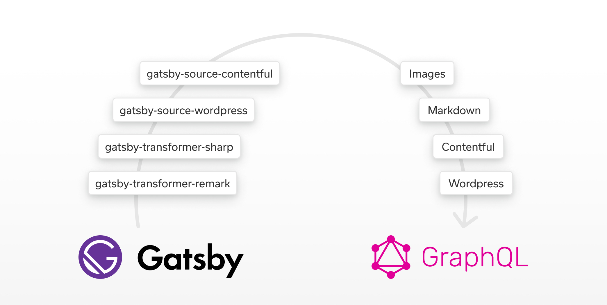
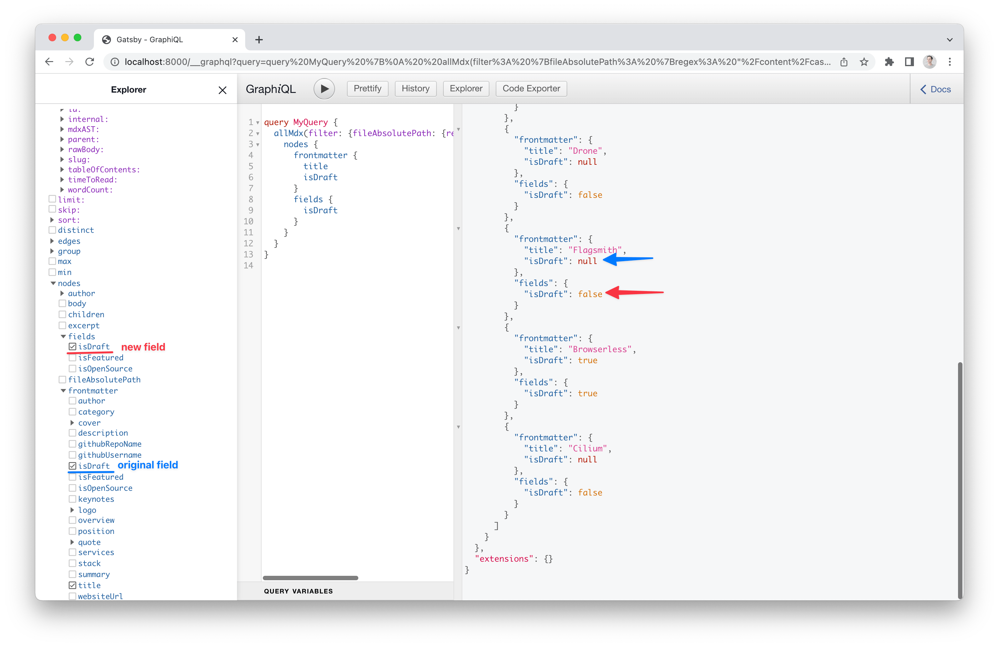
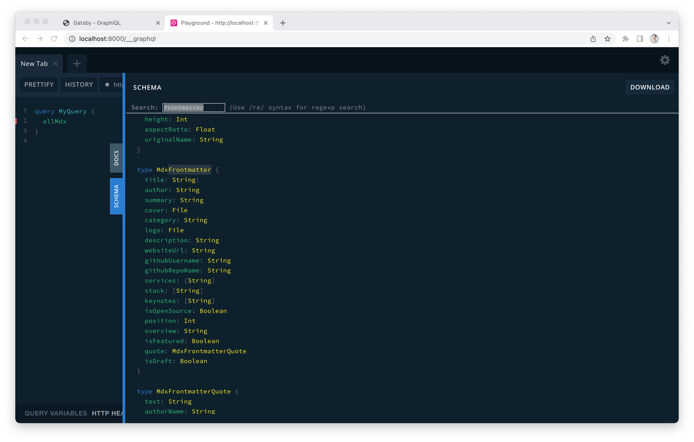
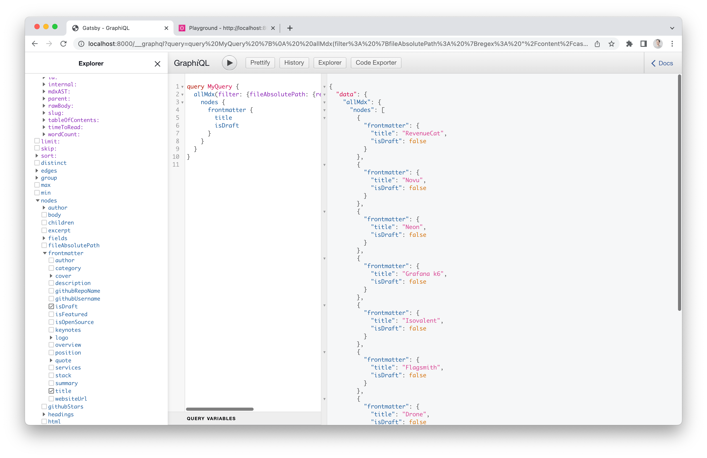
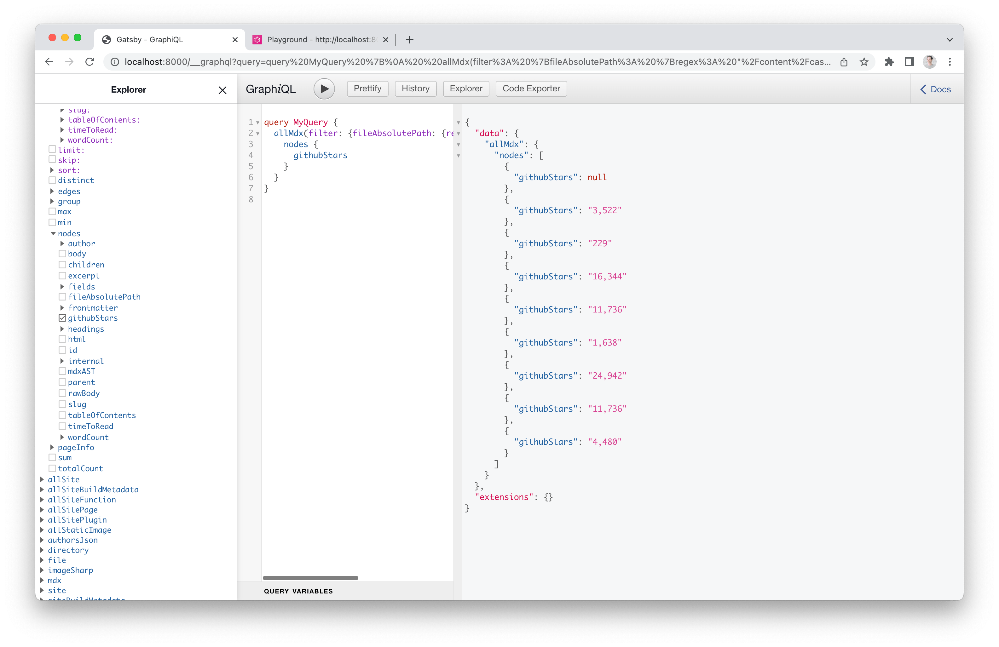
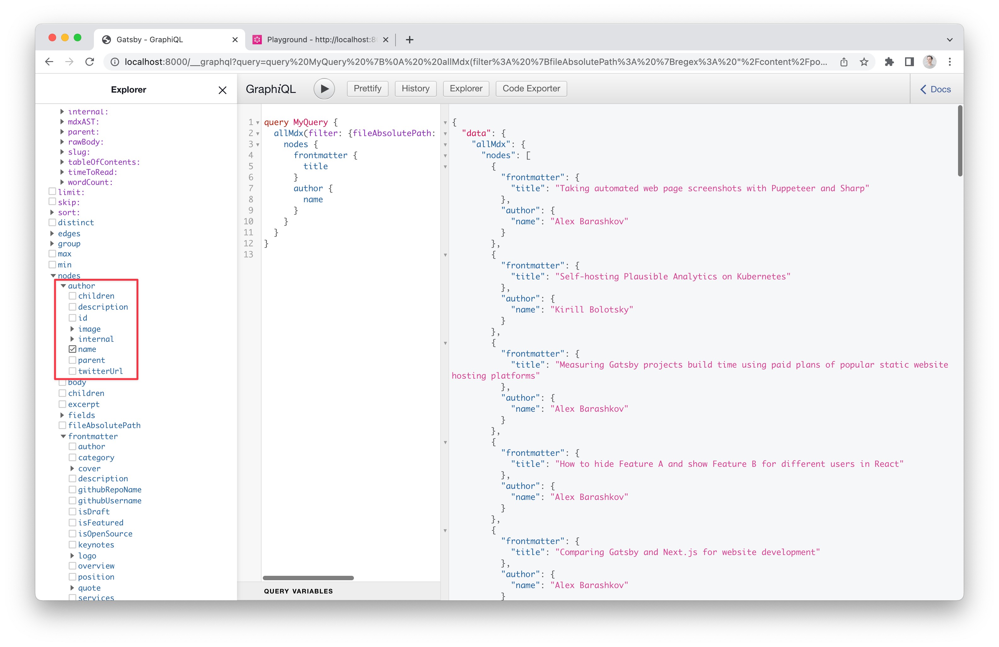

Gatsby has one big difference from other frameworks: it has a built-in Graphql data layer. Such a layer opens a lot of possibilities and is a key part of the big ecosystem of plugins. You can fetch data from CMS using Graphql, query images, query markdown based content with a help of a variety of plugins.

It’s all possible because those plugins fetch data from sources and transform it into Graphql Nodes during build time. In most cases, it’s more than enough, and you even don’t need to be a master of Graphql to use Gatsby and build cool things.

But today I want to talk about Gatsby’s Schema Customization API, since it could drastically improve the quality of projects in certain cases.



## What is Gatsby’s Schema Customization API?

This API allows to interact with a Graphql data layer and customize it the way you want. It could help extend the current Graphql types or create completely new ones.

## Use cases

As a beginner, you would probably benefit from using the following common scenarios:

- Replacing data in the existing Graphql field
- Adding a new field to existing Graphql type and filling it with some data
- Defining relationships between Graphql types

## **Replacing data in the existing Graphql field**

This technique is really helpful when you want to define a default value for an existing field. For example, you have a blog that has articles coming from markdown, and some of them have a flag `draft: true` but others do not. For better filtering, you want to make sure that every blog post has a draft field with either `false` or `true` value in Graphql.

There are two ways to achieve that. First one is using `onCreateNode` API ([docs](https://www.gatsbyjs.com/docs/reference/config-files/gatsby-node/#onCreateNode)) that is provided by Gatsby. Just go to `gatsby-node.js` and add these lines.

```jsx
exports.onCreateNode = ({ node, actions }) => {
  const { createNodeField } = actions;

  if (node.frontmatter) {
    createNodeField({
      node,
      name: 'isDraft',
      value: node.frontmatter.isDraft || false,
    });
  }
};
```

This code will be invoked on each Node creation, so it’s good to filter nodes there by certain parameters to add a field only to the relevant nodes. It’s a quick solution, but it is a bit raw. As you can see, the original `isDraft` field from markdown frontmatter data remains untouched, and we create a new one in that node under `fields` directory.



For better performance, we can use a more granular approach by overriding the original field with a custom resolver. This method requires some more knowledge. We will need to know the exact Graphql type we want to modify. To know the exact name of the type, we can run Gatsby with a special flag `GATSBY_GRAPHQL_IDE=playground npm start`. This way we will see GraphQL Playground instead of GraphqiQL IDE on `http://localhost/__graphql`, and we can get the required information there.



Open the `Schema` panel, find a type using `Ctrl+F`. Once we have found it, we can see that the type we’re looking for is `MdxFrontmatter` and the field isDraft has a `Boolean` type. So with a help of createResolvers API ([docs](https://www.gatsbyjs.com/docs/reference/graphql-data-layer/schema-customization/#createresolvers-api)) declared in `gatsby-node.js` we can define a default value for the field.

```jsx
exports.createResolvers = ({ createResolvers }) => {
  createResolvers({
    MdxFrontmatter: {
      isDraft: {
        type: 'Boolean',
        resolve: ({ isDraft }) => isDraft || false,
      },
    },
  });
};
```

As you can see, there are no more null values in isDraft field and it has either `false` or `true` values.



## Add a new field to the existing Graphql type and fill it with some data

We just figured out how to modify the existing data, but let’s go further and add a completely new field. Let’s look at this example from our website. We have case studies for open source projects stored in markdown, and we want to have the number of stars from GitHub to be fetched during build time for each one of them. It’s a perfect task for Gatsby Graphql schema customization.

So for each case study I want to declare a field `githubStars` and tell Gatsby to fetch data from the GitHub API. We already used createResolvers function for field modification, but it also could add a new field.

From Graphql Playground we can grab a type that used for markdown files, which will be `Mdx`, and then add a new field this way.

```jsx
exports.createResolvers = ({ createResolvers }) => {
  createResolvers({
    Mdx: {
      githubStars: {
        type: 'String',
        resolve: async ({ frontmatter, fileAbsolutePath }) => {
          const { name, githubUsername, githubRepoName, isOpenSource } = frontmatter;

          if (
            fileAbsolutePath.includes('/case-studies/') &&
            isOpenSource &&
            githubUsername &&
            githubRepoName
          ) {
            try {
              const response = await fetch(
                `https://api.github.com/repos/${githubUsername}/${githubRepoName}`
              );
              const { stargazers_count } = await response.json();

              return new Intl.NumberFormat('en-US').format(stargazers_count);
            } catch (e) {
              throw new Error(`Failed to fetch GitHub stars for case study "${name}"`);
            }
          }
          return null;
        },
      },
    },
  });
};
```

Resolve function receives all node data, so it’s easy to filter mdx files based on certain rules e.g., file location folder. Resolver can be an async function so it’s ok to do external calls from there too.



## Define relationships between Graphql types

Another common use case. You have a blog in markdown, and you have a list of authors in JSON. You want to fetch all data from a Graphql layer, so the author is nested to a blog post data. This could be achieved with `createSchemaCustomization` hook from `gatsby-node.js` using `createTypes` API ([docs](https://www.gatsbyjs.com/docs/reference/config-files/gatsby-node/#createSchemaCustomization)).

The structure of the JSON author object could be like this:

```jsx
/// content/posts/post-authors.json
[
  {
    "name": "Alex Barashkov",
    "photo": "../../src/images/post-authors/alex-barashkov.jpg",
    "description": "CEO at Pixel Point and software engineer with 10+ years of web development experience. Currently focused on React, Next.js, Gatsby.",
    "twitterUrl": "https://twitter.com/alex_barashkov"
  },
  ... more authors
]
```

The blog post content, however, could be like this:

```jsx
// content/posts/example.md
---
title: 'Taking automated web page screenshots with Puppeteer and Sharp'
summary: A step-by-step tutorial on how to create perfect high-resolution web page screenshots automatically. No fuss, it just works.
author: Alex Barashkov
cover: cover.jpg
category: Development
---
... Blog post content
```

As you can see, we have a name of the author in a frontmatter post data and the same name in `authors.json`. Now the goal is to make the author accessible via Graphql as a nested object when we fetch post data.

Note: For blog posts we use `gatsby-plugin-mdx`, for sourcing JSON data to Graphql - `gatsby-transformer-json`. See the full example of the project [here](https://github.com/maxel-point/maxelpoint-website).

Here is a config from the `gatsby-config.js` that makes this sourcing happen:

```jsx
{
      resolve: 'gatsby-source-filesystem',
      options: {
        name: 'posts',
        path: `${__dirname}/content/posts`,
      },
    },
    {
      resolve: 'gatsby-source-filesystem',
      options: {
        name: 'post-authors',
        path: `${__dirname}/content/posts/post-authors.json`,
      },
    },
```

We use the same strategy as before: let’s open Graphql Playground. We already know the Graphql type of markdown files, but we need to find a type of JSON based nodes. In our case, it will be `PostAuthorsJson` .

Having that information, we can add `createSchemaCustomization` to `gatsby-node.js` and use a function called `createTypes`. That technique allows to modify the Graphql schema.

Note: If you want to override the existing Graphql type completely, use `@dontInfer` directive near the type definition ([docs](https://www.gatsbyjs.com/docs/reference/graphql-data-layer/schema-customization/#opting-out-of-type-inference)).

There are some options to define nested relationships manually. However, the simplest option is to use a built-in `@link` directive. Think about it as a helper that does a mapping between two Graphql types based on provided foreign key relationships.

<Video src="https://pixel-point-website.s3.amazonaws.com/posts/2022-05-14-gatsby-graphql-schema-customization-for-beginners/video.mp4" width="1920" height="1080" poster="./video-cover-1.jpg" controls muted></Video>

Let’s check it out. Add this code to the `gatsby-node.js` and see the result.

```jsx
exports.createSchemaCustomization = ({ actions }) => {
  const { createTypes } = actions;
  createTypes(`
    type Mdx implements Node {
      author: PostAuthorsJson @link(by: "name", from: "frontmatter.author")
    }
  `);
};
```

Now authors are linked to markdown nodes. This way you can fetch nested data and even filter results by author’s information.



### Summary

Now you know how to modify the Gatsby Graphql schema, and I hope you find it useful for your project. All three examples are available [here](https://github.com/maxel-point/maxelpoint-website) in our GitHub website repository.
